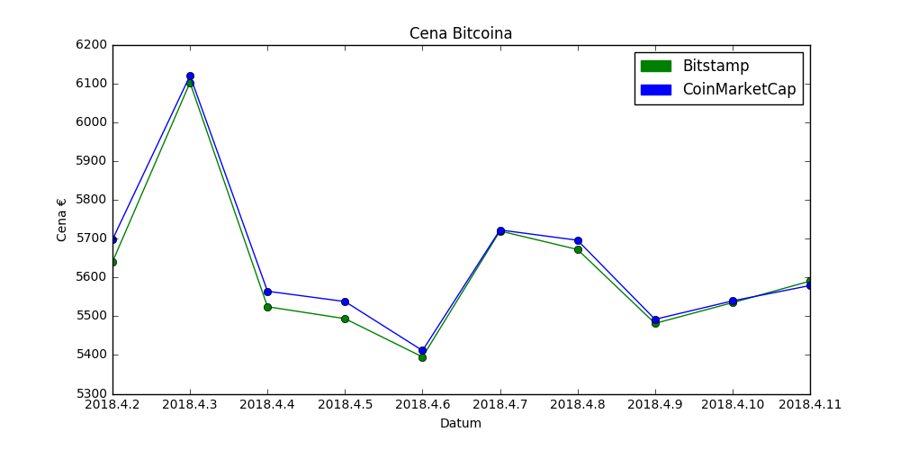

# Reddit za napovedovanje cene Bitcoinov

## Opis Podatkov

### Cena Bitcoinov

Cena Bitcoinov je pridobljena iz spletnih strani [Bitstamp](https://www.bitstamp.net/) in [CoinMarketCap](https://coinmarketcap.com/).

Cena je v evrih in je pridobljena za vsak dan ob približno isti uri.

### Reddit Podatki

Skript za pridobivanje podatkov je shranjen v datoteki "/reddit_data_getter/reddit_data_getter.py". Skript za dostop do Reddita uporablja knjižnico [PRAW](https://github.com/praw-dev/praw). Podatki so shranjeni vsak dan ob približno isti uri.

Reddit podatki so shranjeni v "/data/reddit/", grupirani pa so po Subredditih. Za vsak dan za vsak Subreddit je maksimalno 10 datotek. Te predstavljajo "top" submissione (objave) s časovnim filtrom "day".

Za vsako izmed objav je shranjeno:

* iz katerega Subreddita prihaja
* naslov objave
* kdaj je bil submission objavljen
* točke objave

Prav tako je za vsako objavo shranjenih večina komentarjev. Za vsak komentart je shranjeno:

* Level komentarja (komentar objave ima level 0, komentar komentarja ima level 1, ...)
* kdaj je bil komentar ustvarjen
* točke komentarja
* vsebina komentarja

Podatki so pridobljeni iz naslednjih Subredditov:

* /r/Bitcoin
* /r/btc
* /r/BTCNews
* /r/CryptoCurrency
* /r/BitcoinMarkets

Posebej so shranjene objave "Daily Discussion" iz Subredditov /r/Bitcoin in /r/CryptoCurrency. Če je Dnevna Razprava dovolj popularna je shranjena tudi v podatkih o "top" dnevnih objavah.

## Pregled Podatkov

### Cena Bitcoina

Povprečna cena:

* Bitstamp povprečna cena: 5628.84125
* CoinMarketCap povprečna cena:  5655.46625

Mediana:

* Bitstamp cena mediana: 5628.84125
* CoinMarketCap cena mediana: 5630.345

Najvišja najnižja cena:

* Bitstamp najvišja cena: 6103.0
* Bitstamp najnižja cena: 5395.0
* CoinMarketCap najvišja cena: 6120.96
* CoinMarketCap najnižja cena: 5411.49

Opazimo da se ceni obeh tržišč razlikujeta le za nekaj evrov, ter da sledita enakim trendom (če se zviša ena se zviša tudi druga).

### Reddit Daily Discussion

Število level 0 komentarjev je pri /r/CryptoCurrency večje. Pri obeh subredditih se ob enakih dnevih poveča/zmanjša število komentarjev.

### Reddit Komentarji po dnevih

Ugotovil sem da na /r/btcNews nihče ne komentira. Ta subreddit bom zaradi tega razloga v nadalnih analizah izpustil